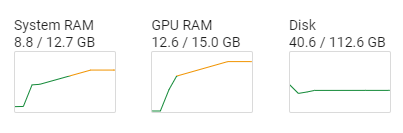

### We made 5 challenges and if you score 47 points we'll offer you $500K/year + equity to join us at 🦥@UnslothAI!

    No experience or PhD needed.

    $400K - $500K/yr: Founding Engineer (47 points)
    $250K - $300K/yr: ML Engineer (32 points)

### Challenges:
1. Convert nf4 / BnB 4bit to Triton
2. Make FSDP2 work with QLoRA
3. Remove graph breaks in torch.compile
4. Help solve Unsloth issues!
5. Memory Efficient Backprop

If you have any questions about the challenges, please feel free to ask! We're looking for people to help push Unsloth forward - so come join us to democratize AI further!

Our past work includes:
1. 1.58bit DeepSeek R1 GGUFs: https://x.com/UnslothAI/status/1883899061893546254
    Introducing 1.58bit DeepSeek-R1 GGUFs! 🐋

    DeepSeek-R1 can now run in 1.58-bit, while being fully functional. We shrank the 671B parameter model from 720GB to just 131GB - a 80% size reduction.

    Naively quantizing all layers breaks the model entirely, causing endless loops & gibberish outputs. Our dynamic quants solve this.

    The 1.58-bit quant fits in 160GB VRAM (2x H100 80GB) for fast inference at ~140 tokens/sec.

    By studying DeepSeek-R1’s architecture, we selectively quantized certain layers to higher bits (like 4-bit), and leave most MoE layers to 1.5-bit.

    Benchmarks + Blog: http://unsloth.ai/blog/deepseekr1-dynamic
    Dynamic GGUFs (131GB–212GB) on Hugging Face: http://huggingface.co/unsloth/DeepSeek-R1-GGUF

2. GRPO with Llama 3.1 8B in a Colab: https://x.com/UnslothAI/status/1887562753126408210
    You can now reproduce DeepSeek-R1's reasoning on your own local device!

    Experience the "Aha" moment with just 7GB VRAM.

    Unsloth reduces GRPO training memory use by 80%.

    15GB VRAM can transform Llama-3.1 (8B) & Phi-4 (14B) into reasoning models.

    
    Blog: http://unsloth.ai/blog/r1-reasoning

3. Gemma bug fixes: https://x.com/danielhanchen/status/1765446273661075609
Found more bugs for #Gemma:
    1. Must add <bos>
    2. There’s a typo for <end_of_turn>model
    3. sqrt(3072)=55.4256 but bfloat16 is 55.5
    4. Layernorm (w+1) must be in float32
    5. Keras mixed_bfloat16 RoPE is wrong
    6. RoPE is sensitive to y*(1/x) vs y/x
    7. (Fixed) RoPE should be float32
    8. (PR) GELU should be approx tanh not exact

    We already pushed all fixes to 
    @UnslothAI
    . Using the 
    @GoogleDeepMind
    impl, I compared the Log L2 norms across layers. Each line is a fix we did.

    Read our blog for more details: https://unsloth.ai/blog/gemma-bugs

4. Gradient accumulation bug fixes: https://x.com/danielhanchen/status/1846235913443262891
Fixed a bug which caused all training losses to diverge for large gradient accumulation sizes.

    1. First reported by @bnjmn_marie, GA is supposed to be mathematically equivalent to full batch training, but losses did not match.
    2. We reproed the issue, and further investigation showed the L2 Norm betw bsz=16 and ga=16 was 10x larger.
    3. The culprit was the cross entropy loss normalizer.
    4. We ran training runs with denormalized CE Loss, and all training losses match.
    5. We then re-normalized CE Loss with the correct denominator across all gradient accumulation steps, and verified all training loss curves match now.
    6. We've already updated 
    @UnslothAI
    with the fix, and wrote up more details in our blog post here: http://unsloth.ai/blog/gradient

    This issue impacts all libraries which use GA, and simple averaging of GA does not work for varying sequence lengths.

    This also impacts DDP and multi GPU training which accumulates gradients. Please update Unsloth via pip install --upgrade --no-cache-dir unsloth and use from unsloth import unsloth_train

    We have a Colab notebook using our fixed GA: https://colab.research.google.com/drive/1z0XJU2FCzDC8oyXa2Nd4jCxylRMI-o0-?usp=sharing and a Kaggle notebook: https://kaggle.com/code/danielhanchen/fixed-kaggle-llama-3-2-1b-3b-conversation/settings

Details & submission guide: https://colab.research.google.com/drive/1JqKqA1XWeLHvnYAc0wzrR