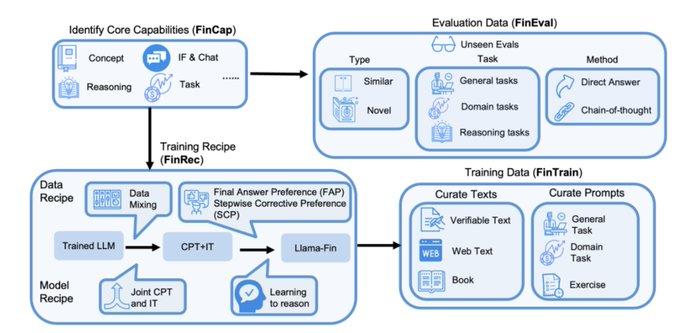
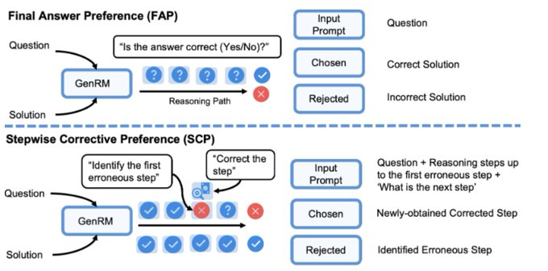
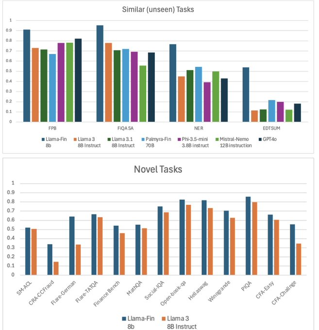

- **Demystifying Domain-adaptive Post-training for Financial LLMs.md**

- Given a strong general-purpose LLM (Llama3-8b-instruct), how to effectively adapt it to a target domain (finance) by post-training? What criteria are desirable for successful adaptation? What are effective training recipes with respect to data and models?

- Introducing 🔥FinDAP 🔥, a novel domain-adaptive post-training framework to answer these questions. The resulting model, Llama-Fin, adapted for the finance domain, achieves:

- 🚀10% - 25% absolute gain for similar (yet unseen) tasks, also outperforming much larger models, including finance-specific Palmyra-Fin-70B and GPT4o
⚡ Up to 20% relative accuracy gain for completely novel tasks (incl. challenging CFA exams)

📘 Paper: https://arxiv.org/abs/2501.04961
🤗 Datasets: https://huggingface.co/datasets/Salesforce/FinEval
🧠 Project Page: https://github.com/SalesforceAIResearch/FinDAP

- FinDAP consists of 4 components to provide a principled guidance for domain-adaptive post-training
1️⃣ FinCap: the core expected capabilities, including concepts, reasoning, instruction-following and tasks
2️⃣ FinRec: data and model recipes to guide domain-adaptive post-training
3️⃣ FinTrain: curates training texts and prompts based on the data recipe
4️⃣ FinEval: a comprehensive evaluation framework designed to assess performance on unseen task

- 🙈 We observe serious forgetting of general capabilities when performing Continual Pretraining (CPT) and Instruction Tuning (IT) sequentially from an instruction-tuned LLM (specially in instruction-following).

- 🔀 Our trick: mix CPT and IT data and train them jointly, downsample CPT data to match the size of IT.

- 🔍Turns out, this not only helps prevent forgetting but also boosts knowledge transfer. Plus, since concepts learned from CPT are often inherently more generalizable due to their shared nature across tasks, combining CPT and IT training improves generalization without requiring exposure to a diverse range of tasks.

- For improvement in reasoning, to balance sparse outcome-based and expensive step-wise rewards, we use a generative reward model (GenRM) with Final Answer Preference (FAP) and Stepwise Corrective Preference (SCP) as follows:
- 🎯FAP: prompt GenRM to give a holistic judgment for the entire solution using a single ‘Yes’ or ‘No’ token.

- 🎯SCP: prompt GenRM to identify the first erroneous step and ask it to provide a correction for that step.

- Using this correction, we construct preference data for reasoning.

- 🚀 Similar (unseen) tasks (e.g. sentiment analysis): Llama-Fin outperforms all other baselines in its size category (10%-25% absolute gain).  It also surpasses significantly larger models, such as the finance-specific Palmyra-Fin-32K (70B). Notably, Llama-Fin also exceeds the performance of the closed model GPT-4o.

- ⚡Novel tasks (e.g., CFA exams): Llama-Fin excels in both finance-specific tasks and reasoning tasks and outperforming Llama-3-8b-instruct by a large amount

- For further questions like how to mix In- and general-domain data? how to curate training and evaluation dataset? Parameter-efficient fine-tuning? Comparing with other finance LLM?
🤔Check out our paper for more discussions and insights!
https://arxiv.org/abs/2501.04961