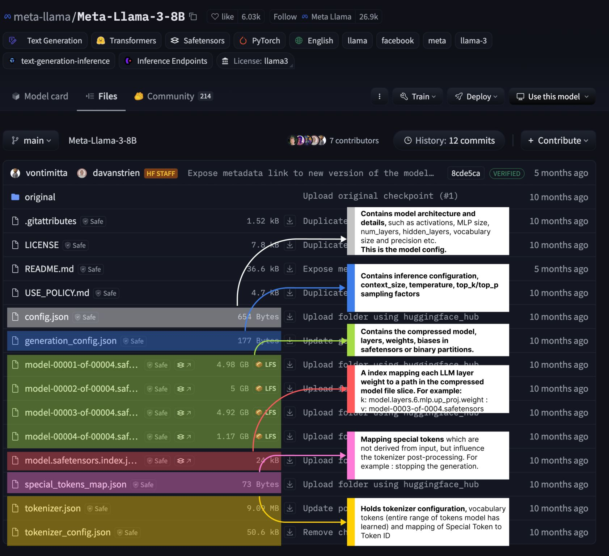

   **LLM file structure**

- 1️⃣ 𝘼𝙧𝙘𝙝𝙞𝙩𝙚𝙘𝙩𝙪𝙧𝙚 𝘾𝙤𝙣𝙛𝙞𝙜𝙪𝙧𝙖𝙩𝙞𝙤𝙣
    This file is usually named config.json, and it contains metadata on model architecture, layer activations, sizes, vocabulary size, number of attention heads, model precision, and more. 

    The transformers library knows how to parse this config and build the model architecture. 

- 2️⃣ 𝙈𝙤𝙙𝙚𝙡 𝙒𝙚𝙞𝙜𝙝𝙩𝙨

    Due to LLMs having B of parameters, the models are usually split into parts for safer download, as no one would like to download an 800GB model and get a network error, ending up with the entire model file being corrupted. 

    These model weights come in either .bin format or .safetensors, a newer, safer format proposed by HuggingFace.

    Safetensors format is an alternative to the default Pickle serializer that PyTorch (pt) used, as it’s vulnerable to code injection.

- 3️⃣ 𝙇𝙖𝙮𝙚𝙧 𝙈𝙖𝙥𝙥𝙞𝙣𝙜
    Since the models are large and weights come as part files (e.g., 0001-of-0006, 0002-of-0006, etc.), this file stores a sequential map of the model architecture, specifying which part file each layer has its weights in.

- 4️⃣ 𝙏𝙤𝙠𝙚𝙣𝙞𝙯𝙚𝙧 𝘾𝙤𝙣𝙛𝙞𝙜
    The tokenizer config file contains metadata about which tokenizer and configuration were used to train this model. 

    It also shows the class name used to instantiate the tokenizer, the layer names, and how the inputs are processed before passing through the model.

    This also contains 𝘴𝘱𝘦𝘤𝘪𝘢𝘭_𝘵𝘰𝘬𝘦𝘯𝘴, tokens not derived from input that LLM uses as markers to stop generation, mark the chat template, differentiate between text and image modalities, etc.

- 5️⃣ 𝙂𝙚𝙣𝙚𝙧𝙖𝙩𝙞𝙤𝙣 𝘾𝙤𝙣𝙛𝙞𝙜
    These configuration files contain metadata for Inference, such as Temperature and TopP/TopK thresholds or context window size the model was trained with. Also, it specifies the token IDs for the special tokens so that the tokenizer can append these IDs to the sequence.